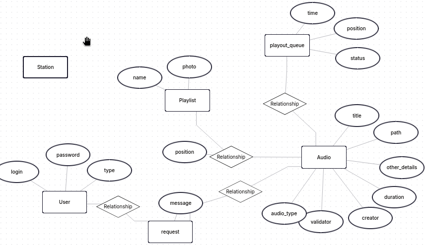

# Sistema de Transmissão de Áudio para o envento da GameNight

Durante o acontecimento da GameNight, colocar caixas de som que toquem músicas, avisos com as programações do evento.

As pessoas poderiam pedir músicas, interagir com os narradores e serem informadas. Do lado do sistema, ficaria pessoas filtrando os pedidos e outras na grade de áudios a serem tocados. Além disso, o sistema incluiria um canal direto de áudio para poder fazer locuções e avisos em tempo real.

## Membros da equipe

**567680** - Victor Farias da Silva (@vistomia) / Sistemas de informação

**570623** - Herlei da Silva Batista (@) / Redes de computadores

# Solução

Sistema de transmissão e gerenciamento de áudio.

Sistema de validação de pedidos de áudio.

# Público Alvo

Universitários da Universidade Federal do Ceará do Campus Quixadá.

Usuário ocasional, vai acessar para fazer apenas um pedido de música.

Uusário regular, vai acessar para aceitar os pedidos de música.

Usuário frequente, vai acessar para gerenciar a transmissão e os áudio.

# Funcionalidades

-
-
-
-
-
-
-

# Diagrama de Entidades

[Definir...]

# links

https://dev.to/carlosorioli/iniciando-um-projeto-nodejs-express-com-typescript-4bfl

pipx run ignr -p node > .gitignore
https://typeorm.io/docs/drivers/sqlite/

https://developer.mozilla.org/en-US/docs/Learn_web_development/Extensions/Server-side/Express_Nodejs/routes

https://typeorm.io/docs/getting-started

# CORES

#876bb2
#febf59
#000
#fff

- camadas separadas

- funcionalidades

- testes unitários
- realizar tratamento de erros / zod
- zod
